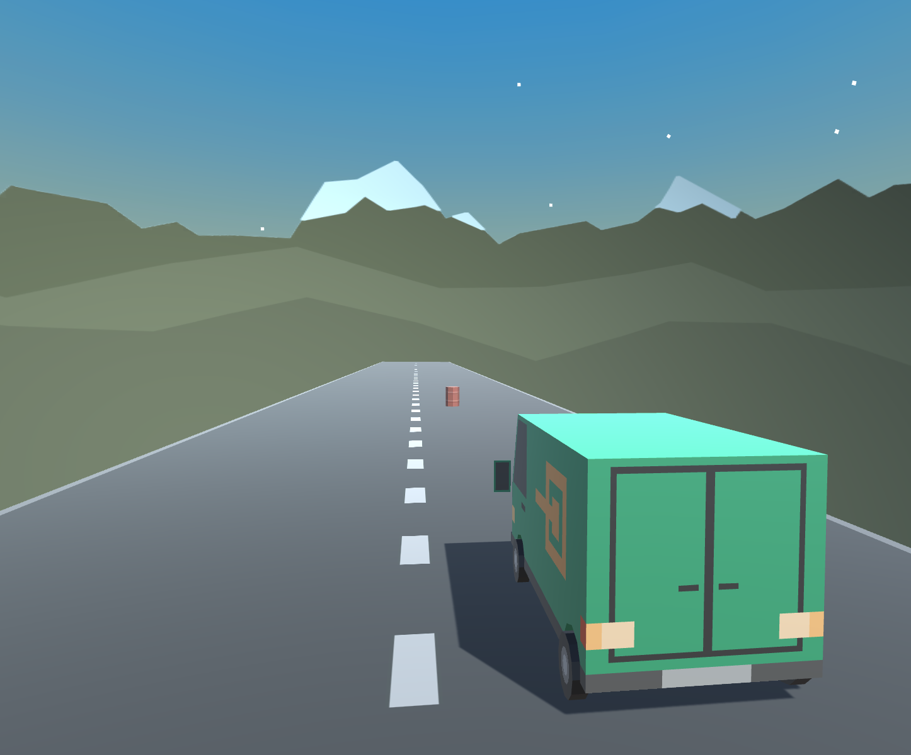

# Lesson Overview

In this lesson, you will *clone* (download) starter code and then open the game project in Unity Hub. You will choose and position a vehicle for the player to drive and add obstacles for them to hit or avoid. You will also postition the camera for the player to see through, establishing their point-of-view for the scene. Through this process, you will learn to navigate the Unity Editor and grow comfortable moving around in 3D Space. Lastly, you will see how to customize your window layout in the Unity Editor.
